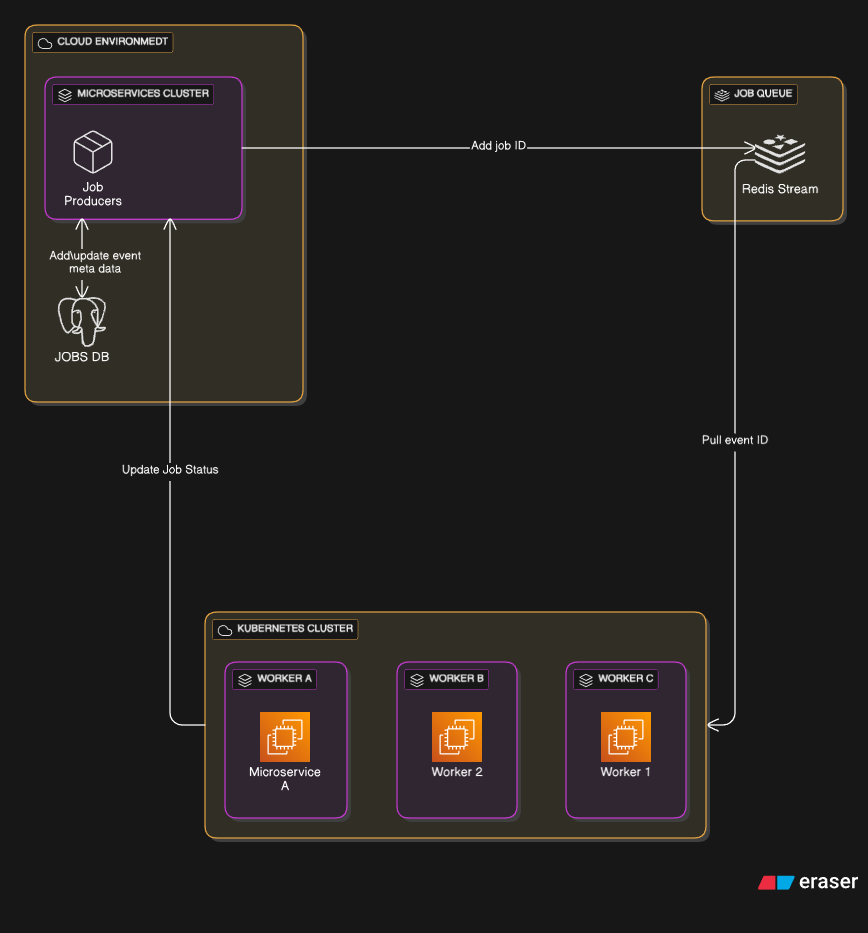

# Vega - Distributed Job Queue Engine
A distributed job queue engine where producers submit tasks via REST API, which are then picked up by worker nodes, executed asynchronously, and tracked for status. Built with Java (Spring Boot) for the API layer, Go for the worker engine, Redis for queueing, and PostgreSQL for persistence.

## Components:
  - Job Producers: Push jobs to "Job Queue".
  - Job Queue: Redis Streams/Kafka (with consumer groups).
  - Workers: Stateless pods (K8s) or EC2 instances.
  - Job State DB: Postgres (for metadata, transactional updates).
  - Dead Letter Queue: Redis Stream #2.
  - Monitoring: Prometheus + Alertmanager.

## Connections:
- Job Producers → Job Queue: Add job (with JSON payload).
- Job Queue → Workers: Workers pull jobs atomically (XREADGROUP).
- Workers → Job State DB: Update status (e.g., "processing" → "done").
- Workers → Dead Letter Queue: Push failed jobs after retries.
- Monitoring ← Job Queue/Workers/DB: Track all metrics.

## Architecture
